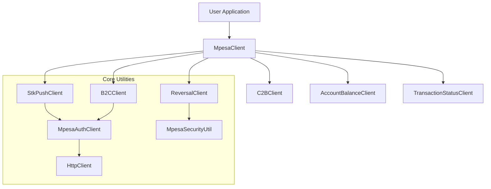

# SDK Architecture and Design Principles

This document provides a detailed overview of the architectural decisions and design patterns used in the **M-Pesa Daraja SDK**.

## 1. Core Principles

The SDK is built upon three pillars:
- **Granularity**: Every M-Pesa service is isolated into its own client.
- **Lightweight**: Zero external networking dependencies using the native Java `HttpClient`.
- **Safety**: Strong typing via Java Records and strict security defaults.

## 2. High-Level Design

The SDK follows a "Service-Client" architecture. The `MpesaClient` serves as a facade (unified entry point) that delegates specific API operations to dedicated client classes.

### Component Diagram



## 3. Granular Responsibility

Unlike "monolithic" SDKs that have a single class with 50 methods, this SDK breaks responsibilities down:

### `MpesaClient` (The Hub)
Standardizes the initialization of the `HttpClient` and the `MpesaAuthClient`. It ensures that all sub-clients share the same configuration and authentication logic while remaining independent in their business logic.

### Standalone Clients (The Spokes)
Each client class (e.g., `B2CClient`) is responsible for:
1.  **Request Construction**: Mapping high-level method parameters to the specific Record model.
2.  **Specialized Logic**: E.g., STK Push password generation or B2C security credential encryption.
3.  **HTTP Execution**: Using the native Java `HttpClient` to communicate with Daraja.
4.  **Error Translation**: Converting HTTP or JSON errors into meaningful Java exceptions.

## 4. Native Networking Engine

We chose the native Java **`HttpClient`** (introduced in Java 11) as the underlying HTTP engine for several reasons:

1.  **Zero Dependencies**: In a modern microservices environment, minimizing dependency bloat is critical. By using the built-in `HttpClient`, the SDK remains extremely lightweight and avoids conflicts with other libraries.
2.  **Asynchronous & Synchronous**: The native `HttpClient` supports both synchronous (`send`) and asynchronous (`sendAsync`) operations, providing flexibility for different integration scenarios.
3.  **Performance**: Built directly into the JDK, it is highly optimized for performance and resource usage without the overhead of heavy third-party frameworks.
4.  **Simplicity**: It provides a clean, fluent API that is easy to understand and debug.

## 5. Data Modeling with Java Records

The SDK uses **Java Records** (Java 16+) for all Request and Response models.

```java
public record B2CResponse(
    @JsonProperty("ConversationID") String conversationId,
    @JsonProperty("ResponseCode") String responseCode,
    ...
) {}
```

### Benefits:
-   **Immutability**: Once a response is received, it cannot be altered, ensuring data integrity across your application.
-   **Conciseness**: No more boilerplate getters, setters, `equals()`, or `hashCode()`.
-   **Precision**: We use `@JsonProperty` to map the exact field names expected (and returned) by Safaricom, including their specific casing (CamelCase or TitleCase).

## 6. Security Architecture

Security is not an afterthought in this SDK.

### The `MpesaSecurityUtil`
This utility class handles:
-   **X.509 Certificate Parsing**: Loading Safaricom’s `.cer` files using `CertificateFactory`.
-   **RSA Encryption**: Encrypting the `InitiatorPassword` with the public key using the `RSA/ECB/PKCS1Padding` algorithm.
-   **Base64 Encoding**: Converting the raw encrypted bytes into the format required by the JSON payloads.

### Authentication Flow
The authentication flow is handled by `MpesaAuthClient`. It utilizes a **Basic Auth** header (ConsumerKey:ConsumerSecret) to obtain a **Bearer Token**. This token is then injected into the headers of every subsequent request made by the service clients.

## 7. Error Handling Strategy

The SDK follows a "Fail-Fast" approach.
-   **Validation**: If a required configuration parameter (like `consumerKey`) is missing, the builder will throw an exception before any network call is made.
-   **Network Failures**: Timeouts and connection issues are caught and wrapped in `RuntimeException` with descriptive messages.
-   **API Errors**: If Safaricom returns a non-200 status code, the SDK logs the error details (including the response body) and throws an exception to prevent your application from proceeding with invalid data.

---

## Conclusion

The architecture of the M-Pesa Daraja SDK is designed to be **robust, lightweight, and easy to maintain**. By leveraging native Java patterns and the built-in `HttpClient`, we provide a foundation that is ready for both simple applications and complex, high-transaction platforms.
